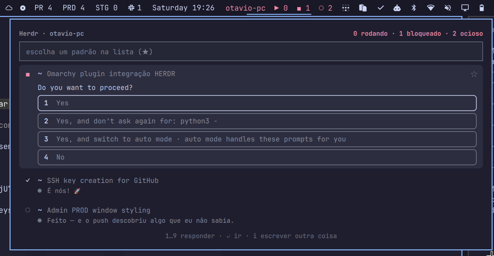

# Quick Herdr

Widget de barra do Omarchy: quantos agentes do [Herdr](https://herdr.dev)
estão rodando, bloqueados e ociosos, o que cada um falou por último, e uma
lista para ir até um deles ou mandar texto sem sair da barra.

```
▶ 2  ◼ 0  ○ 1
```



Clicar abre a lista. Clicar numa linha **vai** até o agente: foca a aba dele
dentro do Herdr e a janela do terminal que roda o cliente. Se não houver
nenhum cliente aberto, abre o terminal padrão do sistema com o `herdr` já
na aba certa.

O campo em cima da lista **manda** uma linha para o agente marcado com **★**,
sem focar nada. É o gesto barato do painel: você responde uma pergunta ou
empilha a próxima tarefa e continua onde estava.

O **#2313** aparece na linha quando o `gh` acha um PR para o branch do
diretório do agente, e leva até ele no navegador.

```
▶  ~                Admin PROD window styling                    ☆
   ●  Inspecting all three source videos

○  nvim.lazy-repo-bak   lazy.nvim                                 ☆
   ●  Resolvido. checkhealth lazy agora está ✅ em tudo.

▶  acme-api       Corrige o cálculo de amortização      #2313   ★
   ❯  o vídeo que fiz do tutorial tu cortou?
   ●  Cortei os 4 segundos iniciais…
   ●  Write(README.md)
```

## Instalar

O diretório do plugin **é** o repositório: é assim que o Omarchy espera
plugins de git, e é o que `omarchy plugin update` sabe atualizar depois.

```bash
omarchy plugin add https://github.com/otavioschwanck/omarchy-quick-herdr.git --enable
```

Ou à mão, que dá no mesmo:

```bash
git clone https://github.com/otavioschwanck/omarchy-quick-herdr.git \
  ~/.config/omarchy/plugins/otavio.quick-herdr
omarchy plugin enable otavio.quick-herdr --section right
```

Widget novo pede `omarchy restart shell` na primeira vez — o hot-reload
recarrega o QML, mas não registra o alvo de IPC.

### Do que ele depende

| | | |
|---|---|---|
| `herdr` | **obrigatório** | vem com o Omarchy; é a sessão que o widget lê |
| `python3` | **obrigatório** | roda `bin/herdr-bar`; só a biblioteca padrão, sem pacote nenhum |
| `hyprctl` | **obrigatório** | acha e foca a janela do terminal; vem com o Hyprland |
| `wl-copy` | opcional | copiar o comando de conserto de um erro |
| `gh` | opcional | números de PR; sem ele a coluna some e o rodapé diz por quê |
| `ssh` | opcional | máquinas remotas |
| `tailscale` | opcional | sugerir máquinas na página de configuração |

Nada é instalado por você: quando um opcional falta, o recurso dele some e o
painel diz qual é e o que fazer.

### O que ele escreve

Só isto, e nada fora daqui:

```
~/.cache/omarchy-quick-herdr/    cache de PR, caminho do herdr remoto, socket ssh
~/.local/state/omarchy-quick-herdr/  o agente marcado com ★
/tmp/omarchy-quick-herdr.log     o log (veja "Logs")
```

A **sua própria entrada** em `~/.config/omarchy/shell.json` também muda, mas
só quando você liga ou desliga uma máquina na página de configuração — e quem
escreve é o próprio shell, pelo `setBarWidget`, que é o dono do arquivo. O
widget não encosta em nenhuma outra entrada nem em configuração de mais
ninguém.

## Remover

```bash
omarchy plugin remove otavio.quick-herdr
```

Isso desabilita e apaga o checkout. Para levar junto o que ele guardou:

```bash
rm -rf ~/.cache/omarchy-quick-herdr ~/.local/state/omarchy-quick-herdr
rm -f /tmp/omarchy-quick-herdr.log
```

Se você tinha máquinas remotas ligadas, o `ControlPersist` fecha os túneis
sozinho em alguns minutos; para fechar na hora, `ssh -O exit <máquina>`.

## Os três números

| glifo | estado do Herdr | |
|---|---|---|
| `▶` | `working` | está rodando agora |
| `◼` | `blocked` | parou numa pergunta ou aprovação |
| `○` | `idle` + `done` | pronto para receber |

`done` é o mesmo `idle` por baixo — é o idle de um trabalho que terminou sem
ninguém olhando. Conta como ocioso na barra, e na lista aparece como `✓`,
porque "terminou enquanto você estava longe" é a linha que você quer abrir
primeiro.

Bloqueado é o único estado que pede você **agora**, então o botão inteiro
vira urgente quando existe um. A barra é vista de relance, e não lida número
a número.

## As mensagens

Uma fala por agente, e três no agente do **★** — é nele que você vai
responder, e para responder precisa da conversa, não da manchete. `●` é o
agente, `❯` é você.

O que dá para ler é o que está na tela do terminal: um agente em tela
alternativa não deixa scrollback, então pedir mais linhas não traz mais
história. Isso combina com o propósito — a lista mostra o que você veria se
focasse a aba, nem mais nem menos.

De cada fala vem só o primeiro parágrafo. Depois dele vem o detalhamento —
listas, tabelas, blocos de código — que numa linha de popup viraria ruído.

Um agente trabalhando mostra a ação do momento (`Write(Panel.qml)`), porque
é isso que o Claude Code está desenhando ali; um agente parado mostra a
última coisa que ele te disse. É a distinção útil: para quem está rodando
você quer saber o que está fazendo, e para quem parou, o que ficou faltando.

Só os primeiros agentes da lista ganham leitura de terminal a cada
atualização (24, ou `maxRows` se for menor). Cada leitura é uma chamada; na
mesma máquina são microssegundos, mas por SSH são idas e voltas, e uma sessão
com trinta agentes não pode travar a barra. E leitura nenhuma acontece com o
popup fechado — aí a barra quer as contagens e mais nada.

## Expandir uma conversa

Cada linha mostra a última fala, cortada numa linha só. **Botão direito** (ou o
chevron que aparece sob o cursor) abre a conversa: as últimas quatro falas,
inteiras, com quebra de linha. Quem está parado numa pergunta já nasce aberto —
a pergunta é o motivo de você ter aberto a lista.

`` é você, `✳` é o agente — a mesma marca que o Claude Code desenha no
terminal, para a lista falar a língua da aba para onde ela leva.

As quatro falas vêm no mesmo pacote da lista, sempre. Ler o terminal é uma
chamada, e extrair quatro falas dela custa o mesmo que extrair uma — então
expandir é instantâneo, em vez de uma ida e volta que, numa máquina remota,
seria pela rede.

Quando o conteúdo passa da altura da tela o painel para de crescer e rola.
Cortar seria perder justamente o fim da conversa, que é a parte nova.

## A janela grande

O `` no canto do painel abre a mesma lista numa **janela de terminal de
verdade** (`bin/quick-herdr-tui`). O painel da barra é feito para o relance:
abre ancorado, fecha quando perde o foco e cabe no que sobra da tela. Para
sentar e acompanhar várias máquinas isso vira limitação — a janela fica
aberta, redimensiona e vai para outro workspace.

| tecla | |
|---|---|
| `↑` `↓` / `j` `k` | navegar |
| `↵` | ir até o agente |
| `espaço` | abrir/fechar a conversa |
| `1`…`9` | responder a alternativa |
| `i` | escrever para o agente sob o cursor |
| `*` | marcar o padrão |
| `r` | atualizar |
| `q` | sair |

A **fonte é do terminal** — `ctrl +` e `ctrl −` no foot, kitty, alacritty e
ghostty. Não há sequência de escape para tamanho de fonte: quem manda nisso é
o emulador, e um `+` nosso que não redimensiona nada seria só um botão morto.
Apertar `+` ali diz isso em vez de engolir a tecla em silêncio.

Não há lógica duplicada entre as duas telas. Todo dado e toda ação passam pelo
mesmo `bin/herdr-bar` que o painel usa; a janela é só uma segunda forma de
olhar e de apertar. O dia em que a leitura de diálogo mudar, muda num lugar só.

## Quando ele para para perguntar

`◼` é o agente parado num diálogo de aprovação. A linha dele mostra a pergunta
e as alternativas como botões:

```
◼  acme-api       Corrige o cálculo                       #2313   ★
   ●  Vou apagar o diretório de scratch antes de recompilar.
   Do you want to proceed?
   [1 Yes] [2 Yes, and don't ask again for rm commands] [3 No, and tell…]
```

Clicar numa alternativa responde e o painel **fica aberto** — o agente muda de
estado em seguida, e ver isso acontecer é metade da razão de responder daqui
em vez de ir até a aba. Com o cursor na linha, `1`…`9` fazem o mesmo.

Duas formas de diálogo aparecem por aí, e cada uma se responde do seu jeito:

- **Numerada** (`❯ 1. Yes` / `2. No`) — o número é a própria tecla, e o widget
  digita esse número, como você digitaria.
- **Lista com cursor** (`❯ No, exit` / `  Yes, I trust this folder`) — não há
  tecla nenhuma para digitar, então o widget anda com as setas até a linha e
  aperta Enter. É por isso que o crachá do número só aparece na primeira
  forma: inventar um número na segunda ensinaria um atalho que não existe.

Antes de apertar qualquer tecla, o `answer` relê o buffer e reconfere que a
posição **e o rótulo** ainda são os que estavam na tela quando você clicou. Um
diálogo pode ter mudado nesse meio tempo, e mandar "para baixo, para baixo,
Enter" num diálogo diferente aprova outra coisa. Quando não bate, ele diz que
o diálogo mudou em vez de arriscar.

O **corpo do diálogo** sobe junto: o comando que ele quer rodar, o `Tip:` que
muda o que você escolheria, a descrição. "Do you want to proceed?" sozinho não
é uma pergunta — é a metade dela que não informa nada.

As linhas vão separadas, e não coladas num parágrafo: um bloco de comando com
as quebras desfeitas fica ilegível. O recuo comum sai (a caixa do diálogo já
empurrava tudo para dentro) e o relativo fica, que é o que mantém o comando
legível. São as **últimas** 24 linhas: o pedido fica colado na pergunta, e o
que está muito acima é histórico da conversa, não o pedido.

Um agente que pergunta de outro jeito — `[y/n]`, texto corrido — não ganha
botão nenhum, mas **ganha a pergunta**: a frase aparece igual, só sem
alternativa para clicar. Botão nenhum é honesto; pergunta nenhuma seria
esconder o que aconteceu. Sobra o campo, que responde qualquer coisa.

As falas da lista ficam elididas em repouso e se abrem inteiras sob o cursor —
a lista continua varrível de relance, e ler tudo custa só apontar. Elas crescem
para baixo, então a linha apontada não foge do ponteiro; as de baixo é que
descem.

### As alternativas que pedem texto

Nem toda alternativa responde sozinha. `No, and tell Claude what to do
differently`, `Chat about this`, `Tell Claude what to change` — essas abrem um
campo e ficam esperando você escrever. Apertar a tecla e parar ali deixaria o
agente travado num input vazio, que é pior que não ter botão.

Então o painel inverte a ordem: clicar numa dessas **não toca no diálogo
ainda**. O campo do topo muda de destino (a borda acende, o placeholder passa
a `escrever em "Chat about this"…`) e só quando você dá Enter é que o widget
escolhe a alternativa, espera a tela reagir e digita o texto. `esc` cancela
sem ter mexido em nada.

A espera é por qualquer mudança no buffer, e não pelo sumiço das alternativas:
há telas que mantêm a lista e abrem o campo ao lado. Agente bloqueado tem tela
parada, então qualquer mudança ali é a resposta à tecla — o que não valeria
para um agente trabalhando, cujo spinner muda sozinho.

### Escrever outra coisa

Mandar texto para um agente bloqueado **recusa** o que ele estava pedindo e
manda o seu texto no lugar. O placeholder do campo diz isso enquanto o alvo
estiver `◼`.

Quem faz isso é o `esc`, que é a saída que o próprio diálogo oferece: o Claude
Code rotula a última alternativa como *"No, and tell Claude what to do
differently (esc)"*. Então o widget aperta `esc`, espera o agente voltar ao
prompt e só então manda o texto — exatamente a sequência que você faria à mão.
Se ele não voltar a tempo, o texto **não** é enviado e o painel diz isso: um
prompt entregue pela metade num diálogo aberto é pior que um erro.

A ordem é tentar primeiro e destravar depois, e não checar antes: entre o
snapshot e o clique o agente pode ter travado, e não há como testar sem essa
corrida. Então o caminho é mandar, e só quando levar o `agent_blocked` é que
o `esc` entra.

## Um Herdr de outra máquina

Um widget só olha quantas máquinas você quiser. Botão direito abre a lista de
interruptores: ligada, os agentes daquela máquina entram na mesma lista;
desligada, o túnel fecha na hora — "desliguei" tem de significar "desconectou",
não "vai desconectar quando der".

"Esta máquina" é um interruptor como os outros, e não a ausência de escolha: dá
para olhar só as remotas, só a local, ou tudo junto.

```json
{ "id": "otavio.quick-herdr", "machines": "desktop servidor", "local": true }
```

A lista vai separada por espaço, e não como array, porque a IPC do shell lê um
argumento `[...]` como lista de argumentos — array de verdade não atravessa
ela. Nome de host não tem espaço, então não há ambiguidade; quem editar o
`shell.json` à mão pode escrever um array, que também é aceito na leitura.

As máquinas são consultadas em paralelo, numa thread cada: com quatro ligadas,
esperar uma de cada vez faria a barra andar no ritmo da soma de todas. Quando
uma falha, o erro aparece **na linha dela** na página de configuração — numa
lista de quatro, "deu erro" não diz qual nem por quê.

Para descobrir os alvos:

```bash
~/.config/omarchy/plugins/otavio.quick-herdr/bin/herdr-bar hosts
```

Isso lista as máquinas da Tailscale, que é a resposta certa aqui: o alvo tem
de continuar valendo de qualquer rede, e um IP de LAN no `shell.json` quebra
na primeira vez que você abre o notebook em outro lugar. Mas é sugestão, não
única porta — qualquer alvo que o seu `~/.ssh/config` entenda serve, apelido
incluído, e `usuario@maquina` quando o login do outro lado for outro.

O alvo sugerido é o **nome curto** (`desktop`) sempre que o MagicDNS o
resolver, e só cai no FQDN quando não resolve. `desktop` é um alvo que você
lê, confere e digita; `desktop.tailnet-abc123.ts.net` é um que você copia e cola
torcendo para não ter errado uma letra do meio.

Na primeira vez, conecte uma vez à mão:

```bash
ssh desktop.tailnet-abc123.ts.net
```

O widget conecta com `BatchMode=yes` e não aceita chave de host nova sozinho
— confiar numa chave nova é decisão sua, não de um processo de fundo. Quando
algo assim falha, o erro no painel já vem com o comando que resolve.

Quando algo falha, a dica vem com o comando que resolve **entre crases**, e o
painel transforma isso num botão de copiar. Um comando que você tem de
redigitar de um popup não é uma dica, é uma pista — e uma linha de
`ssh-copy-id` com nome de máquina da Tailscale é justamente o tipo de coisa
que se digita errado duas vezes antes de acertar.

### Tailscale SSH

Se você quer que a autenticação seja da tailnet e não de chave, o destino
precisa de `sudo tailscale up --ssh`. Sem isso quem atende na porta 22 é o
`sshd` comum, e o erro é `Permission denied (publickey,password)` mesmo com a
Tailscale funcionando — dá para confirmar pelo banner: o Tailscale SSH se
anuncia como `Tailscale`, o outro como `OpenSSH_x.y`.

E a regra `ssh` da ACL precisa ser `"action": "accept"`. Com `"check"`, a
Tailscale pede re-autenticação no navegador de tempos em tempos, e um widget
que conecta com `BatchMode=yes` nunca vai ver essa URL — ele só falha. O
painel reconhece esse erro e diz isso.

Ir até um agente remoto foca a janela local aberta com `herdr --remote ALVO`,
e abre uma se não houver. Os números de PR somem: os repositórios estão na
outra ponta, e rodar `git` nos caminhos que o Herdr remoto devolve daria
número errado ou nenhum — melhor não ter coluna do que ter uma que mente.

### Ir até um agente remoto

Abre `ssh -t <máquina> <caminho-do-herdr>`, e não `herdr --remote`. A diferença
importa: `--remote` traz o cliente **daqui** para o servidor **de lá**, compara
as versões e, quando divergem, abre num `[y/N]` oferecendo atualizar o servidor
remoto — um terminal que para numa pergunta não é "ir até o agente". Com
`ssh -t`, cliente e servidor são os dois de lá: não há o que comparar.

Alinhar as versões também resolveria, mas nem sempre dá. Um build com
self-update desativado nunca vai alinhar, e aí a pergunta seria para sempre.

O preço é o que o `--remote` gerencia sozinho: keepalive, multiplexação e o
paste de imagem. Quem quiser isso abre `herdr --remote` à mão — a janela é
reconhecida do mesmo jeito, e o widget foca ela em vez de abrir outra.

O padrão de atualização sobe para 8 segundos com máquinas remotas (piso de 5),
porque cada uma é uma ida e volta pela rede. A conexão é multiplexada
(`ControlMaster`), então só a primeira paga o handshake.

## Configurar (botão direito)

Botão direito no widget abre a mesma gaveta na página de configuração, com o
seletor de máquina: `esta máquina`, uma linha por par da Tailscale (online ou
não — a máquina pode acordar, e escondê-la seria mentira), e um campo para
qualquer outro alvo SSH. Escolher uma máquina remota sem rótulo definido usa o
nome dela como rótulo, senão duas instâncias ficam idênticas na barra.

Configurar um widget é coisa que se procura **nele**, e não num arquivo cujo
caminho você tem de lembrar. As demais chaves continuam na entrada do widget
em `~/.config/omarchy/shell.json`, que é onde ficariam de qualquer jeito —
esta é a que ninguém adivinha que existe.

Quem escreve é o próprio shell, via `setBarWidget`: ele é o dono do
`shell.json` e recarrega sozinho depois. O widget descobre a própria posição
relendo o arquivo, porque o bar entrega a ele `bar`, `moduleName` e
`settings`, mas não onde ele está na barra.

## Teclado

Com o popup aberto:

| tecla | |
|---|---|
| `↑` `↓` / `j` `k` | navegar |
| `↵` | ir até o agente |
| `1`…`9` | responder a alternativa, na linha de um bloqueado |
| `i` | escrever no campo (`esc` volta para a lista) |
| `*` | marcar/desmarcar o padrão do campo |
| `r` | atualizar, PRs inclusive |
| `esc` | fechar |

E de fora, para quem preferir uma tecla a um clique:

```bash
omarchy-shell otavio.quick-herdr toggle
```

## Todas as chaves

Em `~/.config/omarchy/shell.json`, na entrada do widget:

| chave | padrão | |
|---|---|---|
| `remote` | "" | alvo SSH; vazio = o Herdr desta máquina |
| `label` | "" | rótulo na barra, para distinguir instâncias |
| `session` | `default` | sessão do Herdr |
| `interval` | 4 (8 com `remote`) | segundos entre atualizações das contagens |
| `prInterval` | 180 | segundos entre consultas de PR, só com a lista aberta |
| `maxRows` | 20 | linhas na lista |
| `hideWhenEmpty` | false | sumir da barra quando não houver agente |

## Notas de implementação

- Tudo passa por `bin/herdr-bar`, que devolve uma linha de JSON. Um clique
  aqui vira várias chamadas encadeadas — foco no Herdr, descoberta da janela,
  dispatch do Hyprland — e encadear `Process` em QML é como se escreve
  callback hell. Todo comando sai com 0 e reporta falha dentro do JSON: um
  servidor do Herdr parado não pode parecer um helper quebrado.

- **Qual janela é a do Herdr.** O cliente é neto do emulador de terminal
  (terminal → shell → `herdr`), então a ligação vem de subir a cadeia de
  `ppid` até cair num pid que o compositor conheça. Isso vale para qualquer
  terminal, o que casar por `class` não faria — e nesta máquina já existe uma
  janela de terminal com o título `herdr` cujo `herdr` morreu faz tempo, que
  um casamento por título pegaria errado. Com mais de um cliente aberto,
  ganha o menor `focusHistoryID`: a janela que você usou por último. Um
  terminal em modo servidor, com uma janela só para todas as abas, é o caso
  que isso não resolve.

- **A ordem do foco.** `herdr agent focus` vai antes de a janela existir, de
  propósito. Quando não há cliente nenhum, o terminal novo já sobe
  renderizando a aba certa, e não há corrida entre o attach e um focus que
  chegaria depois.

- **O custo de estar ligado.** O dado que a barra precisa custa 5 ms
  (`herdr api snapshot`); o tick custava 134 ms de CPU. A diferença era partida
  de interpretador, paga de novo a cada atualização — 25 ms de imports mais
  ~13 ms de Python, vezes três processos, porque cada máquina rodava num
  subprocesso para não disputar o global do alvo. Duas mudanças cortaram isso:
  o alvo virou *thread-local*, então as máquinas rodam em threads no mesmo
  processo (134 → 64 ms); e com a lista fechada o intervalo dobra a cada ciclo
  sem novidade, até 60 s. Qualquer mudança nas contagens, ou abrir a lista,
  volta ao piso na hora. Numa sessão parada isso é a diferença entre 0,8 % e
  0,1 % de um núcleo.

- **Achar o `herdr` na outra ponta.** `ssh maquina comando` roda um shell
  não-interativo e não-login: ele não lê o `.zshrc` nem o `.bashrc`, então o
  `PATH` dele é o mínimo do sistema. Um `herdr` em `~/.local/bin` — que é onde
  o instalador dele costuma pôr — simplesmente não existe desse lado, e o erro
  sai como `command not found` numa máquina onde o binário está lá, visível
  para você. Então o caminho absoluto é descoberto uma vez, num shell de
  login, e guardado no cache; pagar esse shell a cada atualização seria caro, e
  adivinhar o diretório seria pior. Se uma chamada voltar a falhar assim, ele
  redescobre antes de desistir — senão uma reinstalação em outro prefixo daria
  um widget que só volta limpando cache à mão.

- **Ler o diálogo** sai da mesma leitura de terminal que as mensagens: um
  `agent read` por agente, e o formulário só é extraído de quem está `blocked`.
  As alternativas sem número se reconhecem pela **coluna** onde o texto começa,
  e não por um marcador — é a única coisa que elas têm em comum com a linha do
  cursor. Por isso a moldura da caixa é tirada só nas barras verticais: um
  `strip()` genérico apagaria justamente o recuo que as identifica.

- **Extrair mensagens** é achar os marcadores de fala na margem do buffer
  (`herdr agent read --source detection`) e parar cada bloco na primeira linha
  de moldura ou na primeira linha em branco. Marcador no meio de um parágrafo
  é conteúdo, não fala nova; e o `❯` sozinho é o prompt vazio esperando você.
  O Herdr suporta 22 tipos de agente e este parser conhece os marcadores dos
  que os usam — para os outros, a linha simplesmente fica sem mensagem, o que
  é melhor que inventar uma.

- **O prompt vai pelo stdin**, nunca pelo argv. Prompt não é segredo, mas
  argv aparece no `ps` de qualquer processo da máquina, e prompt de agente
  costuma carregar caminho, nome de cliente e trecho de código.

- **Dois ritmos.** `snapshot` só lê o cache de PR; quem vai ao GitHub é
  `prs`, e só enquanto a lista está à vista. Uma chamada de rede por
  repositório a cada 4 segundos, para um número que quase nunca muda, seria
  puro desperdício. O cache é chaveado por (repositório, branch) e guarda o
  cwd que o gerou — trocar de branch no mesmo diretório reivindica o cwd para
  a chave nova, senão o snapshot devolveria o PR do branch anterior, num
  número que parece certo e não é.

- **O alvo padrão** é gravado por `pane_id` e, como segunda tentativa, casa
  por `cwd`. Um pane movido para outro workspace ganha um `pane_id` novo, e o
  padrão não pode se perder numa reorganização de layout — é o mesmo agente,
  no mesmo projeto. Quando nenhum dos dois casa, o campo diz que não tem para
  onde mandar em vez de mandar para o vizinho. Cada `remote` e cada `session`
  tem o seu.

- **A lista é o foco inicial.** Um `TextField` visível toma o foco no
  instante em que o painel mapeia, então a lista o reivindica logo depois:
  escrever é um gesto a mais (`i`), não o padrão.

- A ordem das linhas é a do próprio Herdr (workspace, aba, pane). Ordenar por
  estado poria o bloqueado em cima, mas faria a linha fugir do cursor toda vez
  que um agente mudasse de estado; o botão urgente já avisa sem mexer na
  lista.

- O `MouseArea` da linha inteira é declarado **antes** do conteúdo: em QML
  quem vem depois fica por cima e recebe o clique primeiro, e o número do PR e
  a estrela precisam ganhar dele.

- O root repassa `implicitWidth`/`implicitHeight` do botão: o bar dimensiona
  o slot por eles, e sem isso o widget existe, roda e não ocupa espaço nenhum.

## Logs

Tudo que o helper faz de consequência — foco, prompt, resposta a diálogo,
gravação de configuração, descoberta do Herdr remoto, e todo erro — vai para
um arquivo:

```bash
tail -f /tmp/omarchy-quick-herdr.log
```

Uma linha por evento, com hora e a máquina quando é remota:

```
2026-08-29T18:46:10 herdr-remoto-achado remoto=desktop caminho=/home/voce/.local/bin/herdr
2026-08-29T18:52:31 terminal-aberto remoto=desktop pane=w2K:p3
2026-08-29T18:53:04 respondeu remoto=desktop pane=w2K:p3 opcao=Yes
```

O que **não** entra: o snapshot de cada 4 segundos, que encheria o arquivo sem
dizer nada. O log é para o que mudou alguma coisa e para o que falhou.

O arquivo é cortado pela metade quando passa de 1 MB, então pode ficar aberto
sem cuidado. Ele é aberto com `O_NOFOLLOW` e modo `0600`: um nome fixo em
`/tmp` é compartilhado, e alguém pode ter plantado um symlink ali antes — no
pior caso não se registra nada, e nunca se escreve no arquivo de outra pessoa.

## Licença

MIT. Veja [LICENSE](LICENSE).
