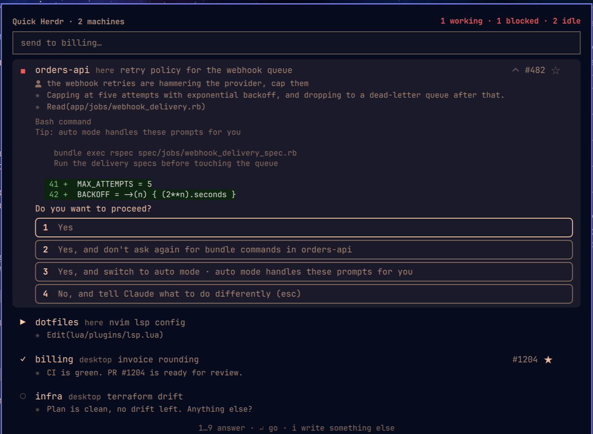

# Quick Herdr

An Omarchy bar widget: how many [Herdr](https://herdr.dev) agents are running,
stopped on a question and idle — across as many machines as you turn on — and
a list to read each one's conversation, go to it, or answer without leaving
the bar.

```
▶ 2  ◼ 0  ○ 1
```



Clicking opens the list. Clicking a row **goes** to the agent: it focuses its
tab inside Herdr and the terminal window running the client. If no client is
open, it launches the system's default terminal with `herdr` already on the
right tab.

The field above the list **sends** one line to the agent marked with **★**,
focusing nothing. It is the panel's cheap gesture: you answer a question or
queue the next task and stay where you were.

The **#2313** appears on a row when `gh` finds a PR for the branch of the
agent's directory, and takes you to it in the browser.

**Right click on the widget opens its settings** — which machines it watches,
and the panel's text size.

| gesture | |
|---|---|
| click the widget | open the list |
| **right click** the widget | settings: machines, text size |
| click a row | go to that agent's tab |
| **right click** a row | open its conversation |
| click an option | answer the dialog |
| click `#2313` | open the PR in the browser |
| click `★` | make that agent the field's target |

Right click means two things because there are two objects: on the bar it acts
on the widget, on a row it acts on that agent.

## Install

The plugin directory **is** the repository: that is how Omarchy expects git
plugins, and it is what `omarchy plugin update` knows how to update later.

```bash
omarchy plugin add https://github.com/otavioschwanck/omarchy-quick-herdr.git --enable
```

Or by hand, which amounts to the same:

```bash
git clone https://github.com/otavioschwanck/omarchy-quick-herdr.git \
  ~/.config/omarchy/plugins/otavio.quick-herdr
omarchy plugin enable otavio.quick-herdr --section right
```

A new widget needs `omarchy restart shell` the first time — the hot reload
reloads the QML, but does not register the IPC target.

### What it depends on

| | | |
|---|---|---|
| `herdr` | **required** | ships with Omarchy; it is the session the widget reads |
| `python3` | **required** | runs `bin/herdr-bar`; standard library only, no packages |
| `hyprctl` | **required** | finds and focuses the terminal window; ships with Hyprland |
| `wl-copy` | optional | copying an error's fix command |
| `gh` | optional | PR numbers; without it the column disappears and the footer says why |
| `ssh` | optional | remote machines |
| `tailscale` | optional | suggesting machines on the settings page |

Nothing is installed for you: when an optional tool is missing, its feature
disappears and the panel says which one and what to do.

On a fresh Omarchy only `gh` tends to be missing — the rest already ships. To
get them all in one go (the command skips whatever is already installed):

```bash
omarchy pkg add github-cli wl-clipboard openssh tailscale
```

`gh` still needs `gh auth login` once, or the PR column stays empty — and the
panel's footer says exactly that, with the command ready to copy.

### What it writes

Only this, and nothing outside it:

```
~/.cache/omarchy-quick-herdr/        PR cache, remote herdr path, ssh socket
~/.local/state/omarchy-quick-herdr/  the agent marked with the star
/tmp/omarchy-quick-herdr.log         the log (see "Logs")
```

**Its own entry** in `~/.config/omarchy/shell.json` changes too, but only when
you turn a machine on or off on the settings page — and the shell itself does
the writing, through `setBarWidget`, which owns the file. The widget touches
no other entry and nobody else's configuration.

## Remove

```bash
omarchy plugin remove otavio.quick-herdr
```

That disables it and deletes the checkout. To take what it kept along with it:

```bash
rm -rf ~/.cache/omarchy-quick-herdr ~/.local/state/omarchy-quick-herdr
rm -f /tmp/omarchy-quick-herdr.log
```

If you had remote machines on, `ControlPersist` closes the tunnels on its own
within a few minutes; to close one now, `ssh -O exit <machine>`.

## The three numbers

| glyph | Herdr state | |
|---|---|---|
| `▶` | `working` | running right now |
| `◼` | `blocked` | stopped on a question or an approval |
| `○` | `idle` + `done` | ready to receive |

`done` is the same `idle` underneath — it is the idle of work that finished
with nobody watching. It counts as idle on the bar, and shows in the list as
`✓`, because "finished while you were away" is the row you want to open first.

Blocked is the only state that asks for you **now**, so the whole button turns
urgent when one exists. The bar is read at a glance, not number by number.

## The messages

One message per row, which is what a closed row shows.

They do not come from the terminal. They used to, and it cost the two things
this list needs most. A terminal screen carries no clock, so no message could
say **when** it happened; and an agent runs on the alternate screen, which keeps
no scrollback — asking `pane read` for 5000 lines returns the same thirty it
returns for 90. There was nothing further back to read, ever.

Claude Code writes every session to `~/.claude/projects/<cwd>/<id>.jsonl`, one
JSON object per line, each with its timestamp. That is the real history:
complete, dated, and already on disk. The terminal is still read, but only for
the blocked dialog — a question and its options are drawn on the screen and
exist nowhere else.

Which session belongs to which pane is the one hard part, and the join is the
title: Claude Code names the session and sets the terminal title from that name,
so Herdr's pane title and the transcript's `ai-title` are the same string. With
git worktrees the lookup uses the directory the agent actually works in, not the
one the pane opened in — nine agents opened from `~/Projetos/api` live in nine
worktrees, and asking by the pane's directory answered the same conversation for
all nine.

An agent that is not Claude Code, or whose session cannot be identified without
guessing, falls back to the terminal text — worse, but never another agent's
conversation shown as if it were this one.

## Expanding a conversation

Each row shows the last message, cut to a single line. **Right click** (or the
chevron that appears under the cursor, or `o` on the keyboard) opens the
conversation. Whoever stopped on a question is born open — the question is why
you opened the list.

An open conversation scrolls **inside its own row** rather than stretching it,
with its own scrollbar on the right. A row tall enough to hold the whole thing
stops being a row in a list, and the panel becomes one long column where you
lose the other agents.

**Fifteen messages, and then the terminal.** Past that a button offers to open
the agent where it runs. Reading a whole conversation is what the terminal is
for; this list exists to tell you which one to go to. The ceiling is also what
keeps an open row cheap — fifty messages laid out as rich text on every refresh
cost ten times the CPU of the whole panel.

### How long it waited

Two messages two seconds apart and two messages two hours apart read
identically once they are lines on a screen. The transcript knows the
difference, so the panel draws it: the **distance** between two messages is how
long the pause was, with a line down the gap and the wait written beside it.

A couple of pixels when the reply came straight back, up to fifteen when it ran
into hours. The scale is logarithmic — linear would spend its whole range inside
the first hour and then draw every longer pause the same, which is exactly the
distinction worth keeping. Under ten minutes there is no label: the spacing
already says it.

Every message also carries its clock, in the margin rather than in the sentence
— a timestamp inside the text gets read as part of it.

### Files it mentions

Every path in an open conversation is a link. Clicking one offers **Open** and
**Copy location**, and paths that name an image also get a small thumbnail,
because a filename does not answer "which screenshot was that".

**Open** picks the right thing to open with. An image goes to the image viewer
through `xdg-open`; a source file goes to your editor **in a terminal window**.
That distinction is not decoration: on this desktop `text/plain` is handled by
`nvim.desktop`, which declares `Terminal=true`, so handing it to `xdg-open`
launches an editor with no terminal to draw in — clicking a `.rb` did nothing at
all while clicking a `.png` worked. The handler's desktop entry is what decides.

A path on another machine is copied with its machine in front
(`otavio-pc:/home/...`), which is what actually opens it when pasted. Opening
one fetches it here first, over the SSH connection the refresh already keeps
open, into `~/.cache/omarchy-quick-herdr/files/<machine>/`. That copy is a copy:
editing it does not edit the file on the other machine.

A slash alone does not make a link — "uma print/imagem" is ordinary prose, so a
path has to have more than one segment or a real extension.

Messages are elided at rest and open whole under the cursor — the list stays
scannable at a glance, and reading everything costs only pointing. They grow
downward, so the row you point at does not run from the pointer.

## When it stops to ask

A blocked agent's row shows the question and the options as buttons. Clicking
one answers and the panel **stays open** — the agent changes state next, and
watching that happen is half the reason to answer from here instead of going
to the tab. With the cursor on the row, `1`…`9` do the same.

Two dialog shapes turn up, and each is answered its own way:

- **Numbered** (`1. Yes` / `2. No`) — the number is the key itself, and the
  widget types that number, as you would.
- **Cursor list** (`No, exit` / `Yes, I trust this folder`) — there is no key
  to type at all, so the widget walks the arrows to the line and presses Enter.
  That is why the number badge only appears in the first shape: inventing a
  number in the second would teach a shortcut that does not exist.

Before pressing any key, `answer` re-reads the buffer and rechecks that the
position **and the label** are still the ones that were on screen when you
clicked. A dialog can have changed in the meantime, and sending "down, down,
Enter" into a different dialog approves something else. When they do not
match, it says the dialog changed rather than risking it.

The **dialog's body** comes along: the command it wants to run, the `Tip:`
that changes what you would choose, the description. "Do you want to proceed?"
on its own is not a question — it is the half of it that informs nothing.

Lines come separated, not glued into a paragraph: a command block with its
breaks undone is unreadable. The common indent is stripped (the dialog box
already pushed everything inward) and the relative one stays, which is what
keeps the command readable. They are the **last** 24 lines: the request sits
against the question, and what is far above is conversation history.

An agent that asks some other way — `[y/n]`, running text — gets no button,
but it **does get the question**: the sentence shows the same, only with
nothing to click. No button is honest; no question would be hiding what
happened.

### The options that ask for text

Not every option answers on its own. `No, and tell Claude what to do
differently`, `Chat about this`, `Tell Claude what to change` — those open a
field and wait for you to write. Pressing the key and stopping there would
leave the agent stuck on an empty input, which is worse than having no button.

So the panel inverts the order: clicking one of those **does not touch the
dialog yet**. The field at the top changes destination (the border lights up,
the placeholder names the option) and only when you press Enter does the widget
choose the option, wait for the screen to react and type the text. `esc`
cancels without having touched anything.

The wait is for any change in the buffer, not for the options to disappear:
some screens keep the list and open the field beside it. A stopped agent has a
still screen, so any change there is the answer to the key — which would not
hold for a working agent, whose spinner changes on its own.

### Writing something else

Sending text to a blocked agent **refuses** what it was asking and sends your
text instead. The field's placeholder says so while the target is blocked.

What does that is `esc`, which is the way out the dialog itself offers: Claude
Code labels the last option *"No, and tell Claude what to do differently
(esc)"*. So the widget presses `esc`, waits for the agent to return to the
prompt and only then sends the text — exactly the sequence you would do by
hand. If it does not come back in time, the text is **not** sent and the panel
says so: a prompt delivered halfway into an open dialog is worse than an error.

The order is to try first and unblock after, rather than checking first:
between the snapshot and the click the agent can have stopped, and there is no
way to test without that race.

## A Herdr on another machine

One widget watches as many machines as you like. Right click opens the list of
switches: on, that machine's agents join the same list; off, the tunnel closes
at once — "I turned it off" has to mean "it disconnected", not "it will
disconnect eventually".

"This machine" is a switch like the others, not the absence of a choice: you
can look at only the remotes, only the local one, or everything together.

```json
{ "id": "otavio.quick-herdr", "machines": "desktop server", "local": true }
```

The list goes space-separated rather than as an array because the shell's IPC
reads a `[...]` argument as an argument list — a real array cannot cross it.
Hostnames have no spaces, so there is no ambiguity; anyone editing `shell.json`
by hand can write an array, which is accepted on read too.

Machines are queried in parallel, one thread each: with four on, waiting for
one at a time would make the bar move at the speed of their sum. When one
fails, the error appears **on its own row** on the settings page — in a list of
four, "something failed" says neither which nor why.

To discover targets:

```bash
~/.config/omarchy/plugins/otavio.quick-herdr/bin/herdr-bar hosts
```

That lists the Tailscale machines, which is the right answer here: the target
has to keep working from any network, and a LAN IP in `shell.json` breaks the
first time you open the laptop somewhere else. But it is a suggestion, not the
only door — any target your `~/.ssh/config` understands works, aliases
included, and `user@machine` when the login on the other end differs.

The suggested target is the **short name** (`desktop`) whenever MagicDNS
resolves it, falling back to the FQDN only when it does not. `desktop` is a
target you read, check and type; `desktop.tailnet-abc123.ts.net` is one you
copy and paste hoping you did not get a letter wrong in the middle.

The first time, connect once by hand:

```bash
ssh desktop.tailnet-abc123.ts.net
```

The widget connects with `BatchMode=yes` and will not accept a new host key on
its own — trusting a new key is your decision, not a background process's.
When something like that fails, the panel's error comes with the command that
fixes it, in backticks, and the panel turns that into a copy button. A command
you have to retype out of a popup is not a hint, it is a lead.

### Tailscale SSH

If you want authentication to come from the tailnet rather than from a key,
the target needs `tailscale up --ssh` with the usual privilege. Without it,
what answers on port 22 is the plain `sshd`, and the error is
`Permission denied (publickey,password)` even with Tailscale working — you can
tell from the banner: Tailscale SSH announces itself as `Tailscale`, the other
one as `OpenSSH_x.y`.

And the ACL's `ssh` rule needs to be `"action": "accept"`. With `"check"`,
Tailscale asks for browser re-authentication periodically, and a widget
connecting with `BatchMode=yes` will never see that URL — it only fails. The
panel recognises that error and says so.

### Going to a remote agent

It opens `ssh -t <machine> <herdr-path>`, not `herdr --remote`. The difference
matters: `--remote` brings the client from **here** to the server **over
there**, compares versions and, when they differ, opens on a `[y/N]` offering
to update the remote server — a terminal stopping on a question is not "go to
the agent". With `ssh -t`, client and server are both from over there: there
is nothing to compare.

Aligning versions would also fix it, but not always. A build with self-update
disabled will never align, and then the question would be forever.

The price is what `--remote` manages on its own: keepalive, multiplexing and
image paste. Whoever wants those opens `herdr --remote` by hand — the window is
recognised just the same, and the widget focuses it instead of opening another.

The refresh default rises to 8 seconds with remote machines (floor of 5),
because each one is a round trip across the network. The connection is
multiplexed (`ControlMaster`), so only the first pays for the handshake.

## Settings (right click)

Right click on the widget opens the same drawer on the settings page, with the
machine picker: this machine, one row per Tailscale peer (online or not — the
machine can wake up, and hiding it would be a lie), and a field for any other
SSH target. Choosing a remote machine with no label set uses its name as the
label, or two instances look identical on the bar.

Below the machines, `+` and `−` set the panel's text size. Only the panel grows,
never the bar button: the bar is one slot among many and cannot widen without
shoving its neighbours, while the popup is a window of its own and can take the
room. At the ceiling it already fills the screen, which is where growing
further would start cutting content instead of showing it. The size is
persisted — how large you need text to be is a property of your eyes and your
monitor, not of one session.

Configuring a widget is something you look for **in it**, not in a file whose
path you have to remember. The remaining keys stay in the widget's entry in
`~/.config/omarchy/shell.json`, which is where they would live anyway — this is
the one nobody guesses exists.

The shell does the writing, through `setBarWidget`: it owns `shell.json` and
reloads on its own afterwards. The widget finds its own position by re-reading
the file, because the bar hands it `bar`, `moduleName` and `settings`, but not
where it sits on the bar.

## Keyboard

With the popup open:

| key | |
|---|---|
| `↑` `↓` / `j` `k` | move |
| `↵` | go to the agent |
| `o` | open/close the conversation |
| `d` `u` | scroll the open conversation |
| `1`…`9` | answer an option, on a blocked row |
| `i` | write in the field (`esc` goes back to the list) |
| `*` | mark/unmark the field's default |
| `r` | refresh, PRs included |
| `esc` | close |

And from outside, for anyone who prefers a key to a click:

```bash
omarchy-shell otavio.quick-herdr toggle
```

## Every key

In `~/.config/omarchy/shell.json`, on the widget's entry:

| key | default | |
|---|---|---|
| `machines` | "" | space-separated SSH targets; empty means only this machine |
| `local` | true | include this machine's agents |
| `label` | "" | label on the bar, to tell instances apart |
| `session` | `default` | Herdr session |
| `interval` | 4 (8 with remotes) | seconds between count refreshes |
| `prInterval` | 180 | seconds between PR lookups, only with the list open |
| `maxRows` | 20 | rows in the list |
| `hideWhenEmpty` | false | disappear from the bar when there is no agent |
| `fontScale` | 1 | the panel's text size, 0.8 to 2.6 (the `+` / `−` on the settings page) |

## Implementation notes

- Everything goes through `bin/herdr-bar`, which returns one line of JSON. One
  click here becomes several chained calls — focus in Herdr, finding the
  window, a Hyprland dispatch — and chaining `Process` in QML is how callback
  hell gets written. Every command exits 0 and reports failure inside the JSON:
  a stopped Herdr server must not look like a broken helper.

- **The cost of being on.** The data the bar needs costs 5 ms
  (`herdr api snapshot`); the tick used to cost 134 ms of CPU. The difference
  was interpreter startup, paid again on every refresh — 25 ms of imports plus
  ~13 ms of Python, times three processes, because each machine ran in a
  subprocess so as not to fight over the target global. Two changes cut that:
  the target became *thread-local*, so machines run on threads in one process
  (134 to 64 ms); and with the list closed the interval doubles on every cycle
  with no news, up to 60 s. Any change in the counts, or opening the list,
  drops back to the floor at once. In a quiet session that is the difference
  between 0.8 % and 0.1 % of a core.

- **Finding `herdr` on the other end.** `ssh machine command` runs a
  non-interactive, non-login shell: it reads neither `.zshrc` nor `.bashrc`, so
  its `PATH` is the system minimum. A `herdr` in `~/.local/bin` — which is
  where its installer tends to put it — simply does not exist on that side, and
  the error reads `command not found` on a machine where the binary is right
  there, visible to you. So the absolute path is discovered once, in a login
  shell, and cached; paying for that shell on every refresh would be expensive,
  and guessing the directory would be worse. If a call fails that way again, it
  rediscovers before giving up.

- **Which window is Herdr's.** The client is the terminal emulator's grandchild
  (terminal, shell, `herdr`), so the link comes from walking the `ppid` chain
  until it lands on a pid the compositor knows. That holds for any terminal,
  which matching on `class` would not, and it is not fooled by a terminal
  window that merely kept the title `herdr` after its herdr died. With more
  than one client open, the lowest `focusHistoryID` wins: the window you used
  last. A terminal in server mode, with one window for every tab, is the case
  this does not solve.

- **The order of focus.** `herdr agent focus` goes before the window exists, on
  purpose. When no client is open, the new terminal comes up already rendering
  the right tab, and there is no race between the attach and a focus arriving
  after it.

- **Reading the dialog** comes out of the same terminal read as the messages:
  one `pane read --format ansi` per agent, and the form is only extracted from
  agents that are blocked. Unnumbered options are recognised by the **column**
  where their text starts, not by a marker — it is the only thing they share
  with the cursor line. That is why the box chrome is stripped only at the
  vertical bars: a generic `strip()` would erase exactly the indent that
  identifies them.

- **Code highlighting comes from the terminal.** Claude Code already highlights
  diffs and command blocks, so the read is `pane read --format ansi` and the
  panel translates the SGR into rich text. Reimplementing a highlighter would
  mean guessing again what the other end already knows. Every color that turns
  up is truecolor, so there is no palette to guess. Measured cost: 66 ms per
  tick against 68 ms before — the same read, now with color.

- **Extracting messages** means finding the speech markers in the buffer's
  margin and stopping each block at the first chrome line or the first blank
  line. A marker in the middle of a paragraph is content, not new speech; and a
  lone prompt marker is the empty prompt waiting for you. Herdr supports 22
  agent kinds and this parser knows the markers of those that use them — for
  the others the row simply has no message, which is better than inventing one.

- **Dialog text is never attributed to anyone.** A line starting with a speech
  marker is speech, and speech with a `?` in it is a question someone asked in
  the conversation, not the one the screen is waiting on. And a menu needs a
  choice: a marked line with no siblings is the prompt, not an option. Without
  those two guards, a pane Herdr marked blocked by mistake produced a
  "question" made of loose conversation — a guess that looks like information.

- **The prompt goes on stdin**, never on argv. A prompt is not a secret, but
  argv shows up in the `ps` of every process on the machine, and an agent
  prompt tends to carry paths, client names and snippets of code.

- **Two rhythms.** `snapshot` only reads the PR cache; `prs` is what goes to
  GitHub, and only while the list is in view. One network call per repository
  every 4 seconds, for a number that almost never changes, would be pure waste.
  The cache is keyed by (repository, branch) and stores the cwd that produced
  it — switching branch in the same directory claims the cwd for the new key,
  or the snapshot would return the previous branch's PR, in a number that looks
  right and is not.

- **The default target** is stored by `pane_id` and, as a second try, matched by
  `cwd`. A pane moved to another workspace gets a new `pane_id`, and the default
  must not be lost in a layout reshuffle — it is the same agent, in the same
  project. When neither matches, the field says it has nowhere to send rather
  than sending to the neighbour.

- **The list is the initial focus.** A visible `TextField` takes focus the
  instant the panel maps, so the list claims it back right after: writing is one
  extra gesture (`i`), not the default.

- **Row order is urgency**: blocked, then working, then done, then idle. Inside
  each state the sort is stable, so rows keep the order Herdr itself shows
  (workspace, tab, pane) and a machine's block does not shuffle on its own. The
  cost is real — a row moves when its agent changes state, which can pull it
  out from under the cursor — and that is the trade for the blocked one always
  being the first thing you read.

- The whole row's `MouseArea` is declared **before** the content: in QML
  whatever comes later sits on top and gets the click first, and the PR number
  and the star need to win against it.

- In Qt Quick a child outside its parent's rectangle **draws but receives no
  mouse**. The header's `Item` used to be as tall as the title alone, so the
  counts row overflowed: it drew over the text field and its clicks fell
  nowhere.

- The root passes the button's `implicitWidth`/`implicitHeight` through: the bar
  sizes the slot by them, and without that the widget exists, runs and takes up
  no space.

- HTML collapses whitespace, which eats exactly the indentation of a code
  block. Every run of two or more spaces becomes a hard space, and so does a
  single one starting a line — a lone space in the middle stays ordinary, or a
  long line would lose where to wrap. Not only on the first run of a line:
  when the line is highlighted the indentation falls inside the colored run,
  and that is where it used to disappear.

## Logs

Everything the helper does that has consequences — focus, prompt, dialog
answer, settings write, discovering the remote Herdr, and every error — goes to
a file:

```bash
tail -f /tmp/omarchy-quick-herdr.log
```

One line per event, with the time and the machine when it is remote:

```
2026-08-29T18:46:10 remote-herdr-found remote=desktop path=/home/you/.local/bin/herdr
2026-08-29T18:52:31 terminal-opened remote=desktop pane=w2K:p3
2026-08-29T18:53:04 answered remote=desktop pane=w2K:p3 option=Yes
```

What does **not** go in: the snapshot every 4 seconds, which would fill the
file without saying anything. The log is for what changed something and for
what failed.

The file is cut in half when it passes 1 MB, so it can be left open without
care. It is opened with `O_NOFOLLOW` and mode `0600`: a fixed name in `/tmp` is
shared, and someone could have planted a symlink there first — in the worst
case nothing is logged, and never into somebody else's file.

## License

MIT. See [LICENSE](LICENSE).
